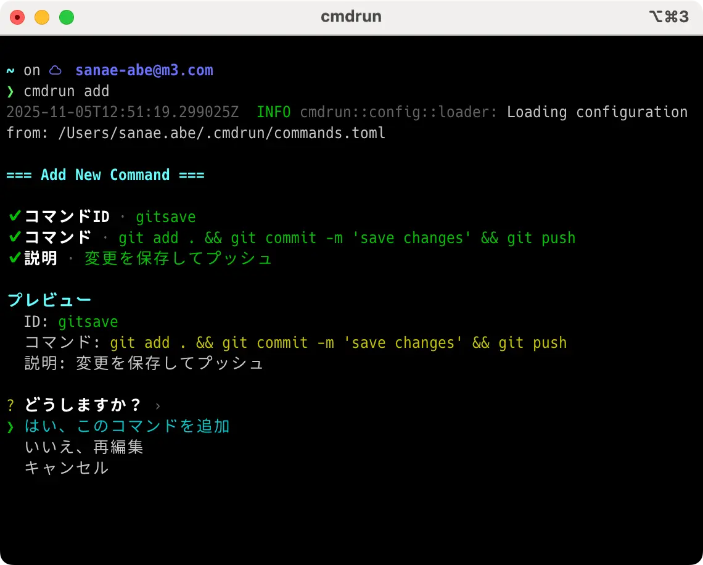
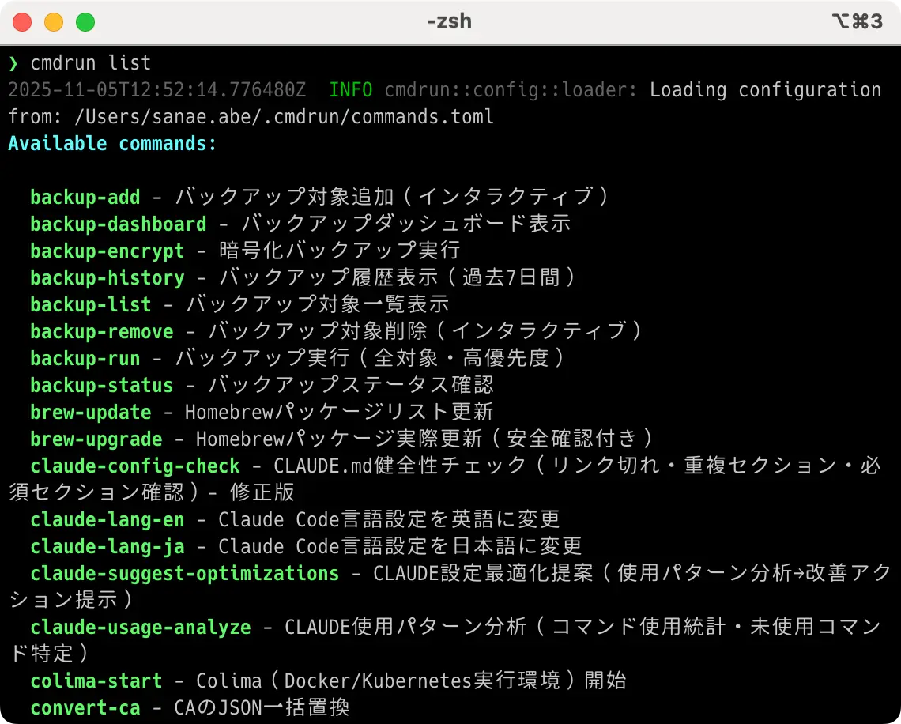

# cmdrun

[](https://github.com/sanae-abe/cmdrun)
[](https://www.rust-lang.org/)
[](LICENSE)

[English](README.md) | [日本語](README.ja.md) | [简体中文](README.zh-CN.md) | [繁體中文](README.zh-TW.md)

> **よく使うコマンドを一元管理するパーソナルコマンドマネージャー**
>
> 一度登録すれば、どこからでも実行可能。高速、安全、クロスプラットフォーム。

## 目次

- [cmdrunの特徴](#cmdrunの特徴)
- [インストール](#インストール)
- [基本的な使い方](#基本的な使い方)
- [機能](#機能)
- [設定例](#設定例)
- [ドキュメント](#ドキュメント)
- [ライセンス](#ライセンス)

## cmdrunの特徴

### 🚀 パフォーマンス
- **起動時間が約29倍高速** - Node.jsベースのタスクランナーと比較
- **起動時間4ms** - npm/yarnの115ms以上と比較
- **メモリフットプリント10MB** - Node.jsの200MB以上と比較

### 🔒 セキュリティ
- **`eval()`ゼロ** - 動的コード実行なし
- **安全な変数展開** - シェルインジェクション脆弱性なし
- **依存関係監査** - ビルトインセキュリティスキャン

### 🌍 クロスプラットフォーム
- **対応OS**: Linux、macOS、Windows、FreeBSD
- **シェル検出**: bash/zsh/fish/pwshを自動検出
- **ネイティブバイナリ**: ランタイム依存なし

### 💎 開発者体験
- **TOML設定** - 型安全で読みやすい
- **強力な機能** - 依存関係、並列実行、フック、Watch Mode
- **優れたエラー表示** - コンテキスト付き詳細エラーメッセージ

### 🎯 独自の優位性

**vs just (24.5k stars):**
- ✅ インタラクティブTUIモード（just: CLIのみ）
- ✅ 実行履歴・統計（just: なし）
- ✅ プラグインシステム（just: なし）
- ✅ 環境管理（just: なし）

**vs task (13.2k stars):**
- ✅ 高度なセキュリティ（eval不使用、fuzzing）
- ✅ 多言語サポート（task: 英語のみ）
- ✅ テンプレートシステム（task: なし）
- ✅ Rust製（task: Go）

**vs cargo-make (2.5k stars):**
- ✅ 2.3倍高速な起動（6.5ms vs 15ms）
- ✅ 言語非依存（cargo-make: Rust特化）
- ✅ モダンなUX（TUI、typo検出）
- ✅ インタラクティブモード

**cmdrunだけが持つ全機能:**
- 🔒 evalゼロのセキュリティとfuzzing（373,423テスト、0脆弱性）
- 🌍 4言語サポート（英・日・簡体中・繁体中）
- 🎨 Fuzzy finder付きインタラクティブTUI
- 📊 SQLiteベース実行履歴
- 🔌 動的プラグインシステム
- 🎯 インテリジェントtypo検出

## インストール

#### システム要件

- **オペレーティングシステム**: Linux、macOS、Windows、FreeBSD
- **Rust**: 1.75以上（MSRV）

#### Rustツールチェーンのインストール

```bash
# 1. Rustup（Rustインストーラー）をダウンロード・実行
curl --proto '=https' --tlsv1.2 -sSf https://sh.rustup.rs | sh

# 2. 環境変数を読み込み
source ~/.cargo/env

# 3. インストール確認
rustc --version
cargo --version
```

#### cmdrunのビルド&インストール

```bash
# 1. リポジトリをクローン
git clone git@github.com:sanae-abe/cmdrun.git
cd cmdrun

# 2. ビルド&インストール
cargo install --path .

# 3. 動作確認
cmdrun --version
cmdrun --help
```

### アップデート

```bash
# ソースからインストールした場合
cd cmdrun  # プロジェクトディレクトリ
git pull

# 再ビルド&インストール
cargo install --path . --force
```

### アンインストール

```bash
# 1. バイナリの削除
cargo uninstall cmdrun

# 2. 設定ファイルの削除（任意）
# Linux/macOS
rm -rf ~/.config/cmdrun

# Windows（PowerShellで実行）
# Remove-Item -Recurse -Force "$env:APPDATA\cmdrun"

# 3. プロジェクトディレクトリの削除（任意）
# cd ..
# rm -rf cmdrun
```

**注意事項:**
- `cargo uninstall cmdrun`は実行ファイルのみを削除します
- 設定ファイル（commands.toml等）は手動で削除する必要があります
- 設定を保持したい場合は、ステップ2をスキップしてください

## 基本的な使い方

cmdrunは**個人向けグローバルコマンド管理ツール**です。頻繁に使うコマンドを登録し、システムのどこからでも実行できます。

#### よく使うコマンドを登録

```bash
# 対話的にコマンドを追加
cmdrun add

# または、直接パラメータを指定して追加
cmdrun add dev "npm run dev" "開発サーバーを起動"
cmdrun add push "git add . && git commit && git push" "変更をコミット＆プッシュ"
cmdrun add prod-ssh "ssh user@production-server.com" "本番サーバーに接続"
cmdrun add docker-clean "docker system prune -af" "未使用のDockerリソースを削除"
cmdrun add db-backup "pg_dump mydb > backup_$(date +%Y%m%d).sql" "データベースをバックアップ"
```

<!--  -->

#### コマンドを実行・管理

```bash
# 登録したコマンドを実行
cmdrun run dev

# 登録されている全コマンドを表示
cmdrun list

# コマンドを検索
cmdrun search docker

# コマンドを削除
cmdrun remove dev
```

<!--  -->

<!--  -->

#### 設定管理

```bash
# 設定を表示
cmdrun config show

# 言語設定を変更
cmdrun config set language japanese

# カスタム設定ファイルを使用
cmdrun --config ~/work/commands.toml list
cmdrun -c ~/.cmdrun/personal.toml run dev

# ヘルプを表示
cmdrun --help
```

**設定ファイルの場所:**
- Linux/macOS: `~/.config/cmdrun/commands.toml`
- Windows: `%APPDATA%\cmdrun\commands.toml`
- カスタムパス: `--config/-c` オプションで任意のパスを指定可能

## 機能

### 変数展開

```toml
[commands.deploy]
cmd = "scp dist/ ${DEPLOY_USER:?DEPLOY_USERが設定されていません}@${DEPLOY_HOST:?DEPLOY_HOSTが設定されていません}:${DEPLOY_PATH:-/var/www}"
```

サポートされる構文：
- `${VAR}` - 基本展開
- `${1}`, `${2}`, ... - 位置引数
- `${VAR:-default}` - デフォルト値
- `${VAR:?error}` - 必須変数
- `${VAR:+value}` - 条件付き置換

**位置引数の例:**

```toml
[commands.convert]
description = "画像フォーマット変換"
cmd = "sharp -i ${1} -f ${2:-webp} -q ${3:-80} -o ${4:-output.webp}"
```

```bash
# 引数を指定して実行
cmdrun run convert input.png webp 90 output.webp
# 展開結果: sharp -i input.png -f webp -q 90 -o output.webp

# デフォルト値を使用
cmdrun run convert input.png
# 展開結果: sharp -i input.png -f webp -q 80 -o output.webp
```

### 依存関係

```toml
[commands.test]
cmd = "cargo test"
deps = ["build"]  # 'test'の前に'build'を実行

[commands.build]
cmd = "cargo build --release"
```

### 並列実行

```toml
[commands.check]
parallel = true
cmd = [
    "cargo fmt -- --check",
    "cargo clippy",
]
```

### プラットフォーム固有のコマンド

```toml
[commands."open:browser"]
cmd.unix = "open http://localhost:3000"
cmd.windows = "start http://localhost:3000"
cmd.linux = "xdg-open http://localhost:3000"
```

### フック

```toml
[hooks]
pre_run = "echo '開始中...'"
post_run = "echo '完了!'"

[hooks.commands.deploy]
pre_run = "git diff --exit-code"  # コミットされていない変更がないことを確認
post_run = "echo '$(date)にデプロイ' >> deploy.log"
```

### 環境変数

```toml
[config.env]
NODE_ENV = "development"
RUST_BACKTRACE = "1"

[commands.dev]
cmd = "npm run dev"
env = { PORT = "3000" }  # コマンド固有の環境変数
```

### 環境管理

開発・ステージング・本番など異なる環境を簡単に切り替えることができます。

```bash
# 環境を作成
cmdrun env create dev --description "Development environment"
cmdrun env create prod --description "Production environment"

# 環境を切り替え
cmdrun env use dev
cmdrun run start  # 開発環境の設定で起動

cmdrun env use prod
cmdrun run deploy  # 本番環境の設定でデプロイ

# 環境変数を設定
cmdrun env set API_URL https://api.staging.com --env staging
```

詳細は[環境管理ガイド](docs/ENVIRONMENT_MANAGEMENT.md)を参照してください。

### 履歴・ログ機能

コマンド実行履歴の記録・検索・再実行が可能です。

```bash
# 履歴を表示
cmdrun history list

# コマンドを検索
cmdrun history search build

# 統計情報を表示
cmdrun history stats

# 最後に失敗したコマンドを再実行
cmdrun retry

# 履歴をエクスポート
cmdrun history export --format json -o history.json
```

詳細は[履歴機能ガイド](docs/user-guide/HISTORY.md)を参照してください。

### テンプレート機能

プロジェクトテンプレートの使用・作成・共有ができます。

```bash
# 利用可能なテンプレートを表示
cmdrun template list

# テンプレートを使用
cmdrun template use rust-cli

# カスタムテンプレートを作成
cmdrun template add my-template

# テンプレートをエクスポート
cmdrun template export rust-cli ./my-template.toml
```

**ビルトインテンプレート:**
- `rust-cli` - Rust CLI開発（cargo build/test/clippy/fmt）
- `nodejs-web` - Node.js Web開発（npm dev/build/test）
- `python-data` - Python データサイエンス（pytest/jupyter）
- `react-app` - React アプリケーション（dev/build/storybook）

詳細は[テンプレート機能レポート](TEMPLATE_FEATURE_REPORT.md)を参照してください。

### プラグインシステム

外部プラグインによる機能拡張が可能です。

```toml
# commands.toml
[plugins]
enabled = ["hello", "logger"]

[plugins.logger]
path = "plugins/logger_plugin.so"
log_file = "cmdrun.log"
level = "info"
```

```bash
# プラグインを一覧表示
cmdrun plugin list

# プラグインの詳細を表示
cmdrun plugin info logger

# プラグインを有効化/無効化
cmdrun plugin enable logger
cmdrun plugin disable logger
```

詳細は[プラグインシステムレポート](PLUGIN_SYSTEM_IMPLEMENTATION_REPORT.md)および[プラグインAPI](docs/plugins/API.md)を参照してください。

### Watch Mode - ファイル監視

```toml
# commands.tomlで通常通りコマンドを定義
[commands.dev]
cmd = "cargo build"

[commands.test]
cmd = "cargo test"
```

```bash
# コマンドラインからWatch Modeで実行
# Rustファイルの変更を監視してビルド
cmdrun watch dev --pattern "**/*.rs"

# テストの自動実行（デバウンス1秒）
cmdrun watch test --pattern "**/*.rs" --debounce 1000

# 複数のディレクトリを監視
cmdrun watch dev --path src --path lib
```

**Watch Modeの主な機能:**
- **Globパターン**: ファイルフィルタリング（例: `**/*.rs`, `**/*.ts`）
- **除外パターン**: 不要なファイル/ディレクトリを除外（デフォルトで`node_modules`, `target`等を除外）
- **デバウンス**: 頻繁な変更時の不要な実行を防止（デフォルト500ms）
- **再帰監視**: サブディレクトリも自動監視（`--no-recursive`で無効化可能）
- **gitignore統合**: `.gitignore`のパターンを自動尊重

詳細は[Watch Modeガイド](docs/user-guide/WATCH_MODE.md)を参照してください。

### インタラクティブモード（TUI）

Fuzzy finderを使った対話的なターミナルUIを起動できます。

```bash
# インタラクティブモード起動
cmdrun interactive
# または
cmdrun -i
```

**機能:**
- 🔍 **Fuzzy Finder**: 全コマンドのインクリメンタルサーチ
- ⚡ **クイック実行**: Enterキーでコマンド実行
- 📊 **ライブプレビュー**: コマンド詳細、依存関係、実行履歴を表示
- ⌨️ **キーボードナビゲーション**:
  - `↑`/`↓` または `j`/`k`: コマンド選択
  - `Enter`: 選択したコマンドを実行
  - `Ctrl+U`: 検索入力をクリア
  - `Ctrl+W`: 単語を後方削除
  - `Esc` または `q`: 終了

**プレビューパネル:**
- コマンドの説明と実際のコマンド文字列
- 環境変数展開後のプレビュー
- 実行統計（実行回数、最終実行時刻）

詳細は [TUI実装サマリー](docs/TUI_IMPLEMENTATION_SUMMARY.md) を参照してください。

### Typo検出

cmdrunはコマンド名のタイポを自動検出し、修正候補を提案します。

**例:**
```bash
$ cmdrun seach docker
Error: Unknown command 'seach'

もしかして:
  → search (distance: 1)
  → watch (distance: 2)

利用可能なコマンドは 'cmdrun --help' で確認してください。
```

**設定:**
```toml
[config]
typo_detection = true
typo_threshold = 2        # 最大Levenshtein距離
auto_correct = false      # trueで自動修正
```

**多言語エラーメッセージ:**
- 英語: "Did you mean 'X'?"
- 日本語: "もしかして: 'X' ですか？"
- 簡体中国語: "您是否想输入 'X'？"
- 繁体中国語: "您是否想輸入 'X'？"

### 言語設定（i18n）

cmdrunは4言語をサポート: **英語、日本語、簡体中国語（简体中文）、繁体中国語（繁體中文）**

**自動言語検出:**
- `LANG` 環境変数を読み取り
- サポート: `en`, `ja`, `zh_CN`, `zh_TW`, `zh_HK`

**ローカライズ済みコマンド（9個）:**
- `cmdrun add`, `search`, `init`, `remove`, `info`
- `cmdrun config`, `watch`, `validate`, `edit`
- Typo提案の多言語エラーメッセージ

**設定:**
```toml
[config]
language = "japanese"  # または "english", "chinese-simplified", "chinese-traditional"
```

**例（日本語）:**
```bash
$ cmdrun add test "echo テスト" "テストコマンド"
📝 コマンドを追加中 'test' ...
✓ コマンドを追加しました 'test'
  説明: テストコマンド
  コマンド: echo テスト
```

**ドキュメント:**
- English: [README.md](README.md)
- 日本語: [README.ja.md](README.ja.md)
- 简体中文: [README.zh-CN.md](README.zh-CN.md)
- 繁體中文: [README.zh-TW.md](README.zh-TW.md)

詳細は [I18Nガイド](docs/user-guide/I18N.md) を参照してください。

### カスタム設定ファイル

`--config/-c`オプションで複数の設定ファイルを使い分けることができます。

**使用例：**

```bash
# 仕事用のコマンド
cmdrun --config ~/work/commands.toml list
cmdrun -c ~/work/commands.toml run deploy

# 個人用のコマンド
cmdrun -c ~/personal/commands.toml run backup

# プロジェクト固有のコマンド
cd ~/projects/myapp
cmdrun -c ./commands.toml run dev
```

**ユースケース：**

1. **環境別の設定**
   ```bash
   # 本番環境用
   cmdrun -c ~/.cmdrun/production.toml run deploy

   # ステージング環境用
   cmdrun -c ~/.cmdrun/staging.toml run deploy

   # 開発環境用
   cmdrun -c ~/.cmdrun/development.toml run dev
   ```

2. **複数のプロジェクト管理**
   ```bash
   # プロジェクトA
   cmdrun -c ~/projects/project-a/commands.toml run test

   # プロジェクトB
   cmdrun -c ~/projects/project-b/commands.toml run test
   ```

3. **役割別のコマンド**
   ```bash
   # システム管理用
   cmdrun -c ~/.cmdrun/admin.toml run server-check

   # 開発用
   cmdrun -c ~/.cmdrun/dev.toml run code-review
   ```

**詳細は[設定リファレンス](docs/user-guide/CONFIGURATION.md#カスタム設定ファイルの指定)を参照してください。**

## 設定例

設定ファイル（`~/.config/cmdrun/commands.toml`）を直接編集することで、より高度な機能を使用できます：

```toml
# 依存関係を持つコマンド
[commands.deploy]
description = "本番環境へデプロイ"
cmd = "ssh user@server 'cd /app && git pull && npm install && pm2 restart app'"
deps = ["test"]  # テストが成功してからデプロイ
confirm = true   # 実行前に確認

[commands.test]
description = "テストを実行"
cmd = "npm test"

# 環境変数を使用
[commands.backup]
description = "バックアップを作成"
cmd = "rsync -avz ~/projects/ ${BACKUP_PATH:?BACKUP_PATH not set}"

# プラットフォーム別のコマンド
[commands.open]
description = "ブラウザを開く"
cmd.unix = "open http://localhost:3000"
cmd.windows = "start http://localhost:3000"
cmd.linux = "xdg-open http://localhost:3000"
```

## ドキュメント

### ユーザーガイド
- [CLIリファレンス](docs/user-guide/CLI.md)
- [設定リファレンス](docs/user-guide/CONFIGURATION.md)
- [国際化（i18n）](docs/user-guide/I18N.md)
- [Watch Mode](docs/user-guide/WATCH_MODE.md)
- [履歴機能](docs/user-guide/HISTORY.md)
- [FAQ](docs/user-guide/FAQ.md)
- [レシピ集](docs/user-guide/RECIPES.md)
- [トラブルシューティング](docs/user-guide/TROUBLESHOOTING.md)

### 機能ガイド
- [環境管理](docs/ENVIRONMENT_MANAGEMENT.md)
- [テンプレート機能](TEMPLATE_FEATURE_REPORT.md)
- [プラグインシステム](PLUGIN_SYSTEM_IMPLEMENTATION_REPORT.md)

### プラグイン開発
- [プラグインAPI仕様](docs/plugins/API.md)
- [プラグイン開発ガイド](docs/plugins/DEVELOPMENT_GUIDE.md)
- [サンプルプラグイン](examples/plugins/README.md)

### 技術ドキュメント
- [アーキテクチャ](docs/technical/ARCHITECTURE.md)
- [パフォーマンス](docs/technical/PERFORMANCE.md)
- [パフォーマンスガイド](docs/technical/PERFORMANCE_GUIDE.md)
- [セキュリティ](docs/technical/SECURITY.md)
- [クロスプラットフォームサポート](docs/technical/CROSS_PLATFORM.md)
- [配布](docs/technical/DISTRIBUTION.md)

## ライセンス

このプロジェクトは[MIT License](LICENSE)の下でライセンスされています。

---
**開発者**: sanae.a.sunny@gmail.com
