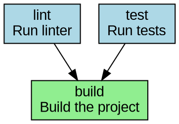
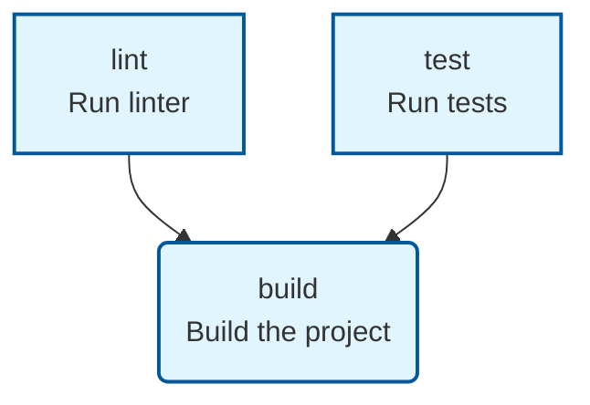

# CLI Reference

[English](CLI.md) | [日本語](CLI.ja.md)

Complete reference for all cmdrun command-line interface commands and options.

## Table of Contents

- [Global Options](#global-options)
- [Commands](#commands)
  - [run](#run)
  - [list](#list)
  - [add](#add)
  - [remove](#remove)
  - [edit](#edit)
  - [info](#info)
  - [search](#search)
  - [open](#open)
  - [init](#init)
  - [validate](#validate)
  - [graph](#graph)
  - [completion](#completion)
  - [completion-list](#completion-list)
- [Exit Codes](#exit-codes)
- [Configuration](#configuration)

---

## Global Options

These options are available for all commands:

### `-h, --help`

Display help information for cmdrun or a specific command.

**Examples:**

```bash
# Show general help
cmdrun --help

# Show help for a specific command
cmdrun run --help
cmdrun add --help
```

### `--version`

Display the version of cmdrun.

**Example:**

```bash
cmdrun --version
# Output: cmdrun 1.0.0
```

### `-v, --verbose`

Enable verbose output for debugging and detailed information.

- `-v`: Debug level logging
- `-vv`: Trace level logging

**Example:**

```bash
# Standard output
cmdrun run build

# Verbose output
cmdrun -v run build

# Very verbose output
cmdrun -vv run build
```

---

## Commands

### run

Execute a command defined in your configuration.

#### Synopsis

```bash
cmdrun run [OPTIONS] <NAME> [-- ARGS...]
```

#### Description

Runs the specified command from your `commands.toml` configuration file. If the command has dependencies, they will be executed first in the correct order. Supports both sequential and parallel execution modes.

#### Arguments

- `<NAME>` - The name/ID of the command to execute (required)
- `[ARGS...]` - Additional arguments to pass to the command (optional)

#### Options

- `-p, --parallel` - Execute dependencies in parallel when possible

#### Examples

**English:**

```bash
# Run a simple command
cmdrun run test

# Run command with parallel dependency execution
cmdrun run build --parallel

# Pass additional arguments to the command
cmdrun run dev -- --port 8080

# Run with verbose output
cmdrun -v run build
```

**Japanese (日本語):**

```bash
# シンプルなコマンド実行
cmdrun run test

# 並列実行で依存関係を解決
cmdrun run build --parallel

# コマンドに追加引数を渡す
cmdrun run dev -- --port 8080

# 詳細出力で実行
cmdrun -v run build
```

#### Output Example

```
Running: Build the project (with parallel dependencies)
📋 Execution plan: 3 groups
▶ Group 1/3 (2 commands)
  ✓ lint completed in 1.23s
  ✓ test completed in 2.45s
▶ Group 2/3 (1 commands)
  ✓ compile completed in 5.67s
▶ Group 3/3 (1 commands)
  ✓ package completed in 1.89s
✓ All commands completed in 11.24s
```

---

### list

List all available commands from the configuration.

#### Synopsis

```bash
cmdrun list [OPTIONS]
```

#### Description

Displays all commands defined in your `commands.toml` file with their descriptions. Use the verbose flag to see detailed information including command specifications and dependencies.

#### Options

- `-v, --verbose` - Show detailed information for each command

#### Examples

**English:**

```bash
# List all commands
cmdrun list

# List with detailed information
cmdrun list --verbose
```

**Japanese (日本語):**

```bash
# コマンド一覧を表示
cmdrun list

# 詳細情報付きで表示
cmdrun list --verbose
```

#### Output Example

**Standard output:**

```
Available commands:

  build - Build the project
  clean - Clean build artifacts
  dev - Start development server
  test - Run all tests
```

**Verbose output:**

```
Available commands:

  build - Build the project
    Command:
      cargo build --release
    Dependencies: ["lint", "test"]

  dev - Start development server
    Command:
      cargo watch -x run
    [...]
```

---

### add

Add a new command to the configuration file.

#### Synopsis

```bash
cmdrun add [OPTIONS] [ID] [COMMAND] [DESCRIPTION]
```

#### Description

Adds a new command entry to your `commands.toml` configuration file. Can be used in interactive mode (when arguments are omitted) or with all arguments provided for scripting.

Interactive mode provides a guided experience with:
- Input validation
- Preview before saving
- Back navigation support
- Multi-language prompts

#### Arguments

- `[ID]` - Unique command identifier (optional, will prompt if omitted)
- `[COMMAND]` - Command to execute (optional, will prompt if omitted)
- `[DESCRIPTION]` - Command description (optional, will prompt if omitted)

#### Options

- `-c, --category <CATEGORY>` - Category for the command
- `-t, --tags <TAGS>` - Comma-separated tags for the command

#### Examples

**English:**

```bash
# Interactive mode
cmdrun add

# Add with all arguments
cmdrun add build "cargo build --release" "Build release binary"

# Add with category and tags
cmdrun add test "cargo test" "Run tests" \
  --category testing \
  --tags rust,ci

# Quick one-liner
cmdrun add lint "cargo clippy" "Lint code"
```

**Japanese (日本語):**

```bash
# 対話モードで追加
cmdrun add

# 全ての引数を指定して追加
cmdrun add build "cargo build --release" "リリースビルド"

# カテゴリとタグを指定
cmdrun add test "cargo test" "テスト実行" \
  --category testing \
  --tags rust,ci

# ワンライナーで追加
cmdrun add lint "cargo clippy" "リンター実行"
```

#### Interactive Mode Example

```
=== Add New Command ===

Command ID: build
Command: cargo build --release
Description: Build release binary

Preview
  ID: build
  Command: cargo build --release
  Description: Build release binary

What would you like to do?
❯ Yes, add this command
  No, edit again
  Cancel

📝 Adding command 'build' to commands.toml
✓ Command added successfully 'build'
  Description: Build release binary
  Command: cargo build --release
```

---

### remove

Remove a command from the configuration file.

#### Synopsis

```bash
cmdrun remove [OPTIONS] <ID>
```

#### Description

Removes a command entry from your `commands.toml` configuration file. Creates a backup before modification for safety. Requires confirmation unless the `--force` flag is used.

#### Arguments

- `<ID>` - Command ID to remove (required)

#### Options

- `-f, --force` - Skip confirmation prompt
- `-c, --config <PATH>` - Path to configuration file (default: auto-detect)

#### Examples

**English:**

```bash
# Remove with confirmation
cmdrun remove old-command

# Remove without confirmation
cmdrun remove old-command --force

# Remove from specific config file
cmdrun remove build --config ./custom-commands.toml
```

**Japanese (日本語):**

```bash
# 確認プロンプト付きで削除
cmdrun remove old-command

# 確認なしで削除
cmdrun remove old-command --force

# 指定した設定ファイルから削除
cmdrun remove build --config ./custom-commands.toml
```

#### Output Example

```
Removal target:
  ID: old-command
  Description: Obsolete build script
  Command: make old-build

Are you sure? (y/N): y

✓ Backup created: commands.toml.backup.20231105_143022
✓ Command removed successfully 'old-command'
```

---

### edit

Edit an existing command interactively.

#### Synopsis

```bash
cmdrun edit [ID]
```

#### Description

Opens an interactive editor to modify an existing command's properties including description, command string, tags, and execution settings. If no command ID is provided, displays a selection menu.

#### Arguments

- `[ID]` - Command ID to edit (optional, will prompt if omitted)

#### Examples

**English:**

```bash
# Edit specific command
cmdrun edit build

# Interactive command selection
cmdrun edit
```

**Japanese (日本語):**

```bash
# 特定のコマンドを編集
cmdrun edit build

# 対話的にコマンド選択
cmdrun edit
```

#### Output Example

```
Current settings
  ID: build
  Description: Build the project
  Command: cargo build
  Tags: []
  Parallel: false
  Confirm: false

Description (Build the project): Build release binary
Command (cargo build): cargo build --release
Tags (comma-separated) (): rust,build
Parallel execution (false): false
Confirm before execution (false): false

✓ Command updated successfully 'build'
```

---

### info

Show detailed information about a command.

#### Synopsis

```bash
cmdrun info [ID]
```

#### Description

Displays comprehensive information about a specific command including:
- Description
- Command specification (single, multiple, or platform-specific)
- Dependencies
- Tags
- Working directory
- Environment variables
- Execution settings
- Platform support

#### Arguments

- `[ID]` - Command ID to display info for (optional, will prompt if omitted)

#### Examples

**English:**

```bash
# Show info for specific command
cmdrun info build

# Interactive selection
cmdrun info
```

**Japanese (日本語):**

```bash
# 特定のコマンドの情報表示
cmdrun info build

# 対話的に選択
cmdrun info
```

#### Output Example

```
Command details: build
━━━━━━━━━━━━━━━━━━━━━━━━━━━━━━━━━━━━━━━━━━━━━━━━━━

Description: Build the project

Command:
  cargo build --release

Dependencies:
  → lint
  → test

Tags: rust, build, ci

Execution settings:
  Parallel: yes
  Confirm: no
  Timeout: 300s

Platforms: Unix, Linux, macOS
```

---

### search

Search commands by keyword.

#### Synopsis

```bash
cmdrun search <KEYWORD>
```

#### Description

Searches through all commands for the specified keyword (case-insensitive). Searches in:
- Command IDs
- Descriptions
- Command text
- Tags

Results show where the keyword was matched (id, description, command, or tags).

#### Arguments

- `<KEYWORD>` - Keyword to search for (required)

#### Examples

**English:**

```bash
# Search for test-related commands
cmdrun search test

# Search for build commands
cmdrun search build

# Search by tag
cmdrun search rust
```

**Japanese (日本語):**

```bash
# テスト関連のコマンドを検索
cmdrun search test

# ビルド系コマンドを検索
cmdrun search build

# タグで検索
cmdrun search rust
```

#### Output Example

```
Searching for: 'test'

✓ Found 3 matching command(s):

  • integration-test - Run integration tests
    Matched in: id, description

  • test - Run all tests
    Matched in: id, description, tags

  • test-watch - Run tests in watch mode
    Matched in: id, command

💡 Use cmdrun info <command> to see details
```

---

### open

Open the configuration file in the default editor.

#### Synopsis

```bash
cmdrun open
```

#### Description

Opens your `commands.toml` configuration file in the system's default editor or a suitable text editor. Searches for the configuration file in:
1. Current directory (`./commands.toml`)
2. Parent directories (searching upward)
3. Global directory (`~/.cmdrun/commands.toml`)

Attempts to use editors in the following order:
- **macOS**: `open`, `code`, `vim`
- **Linux**: `xdg-open`, `code`, `vim`, `nano`
- **Windows**: `code`, `notepad`

#### Examples

**English:**

```bash
# Open configuration file
cmdrun open
```

**Japanese (日本語):**

```bash
# 設定ファイルを開く
cmdrun open
```

#### Output Example

```
Opening: /path/to/project/commands.toml
✓ Opened in code
```

---

### init

Initialize a new commands.toml configuration file.

#### Synopsis

```bash
cmdrun init [OPTIONS]
```

#### Description

Creates a new `commands.toml` configuration file from a template. Provides several project-specific templates optimized for different development environments.

Available templates:
- **default** - Generic command runner configuration
- **web** - Web development (HTML/CSS/JS)
- **rust** - Rust project with cargo commands
- **node** - Node.js project with npm/yarn commands
- **python** - Python project with common tools

#### Options

- `-t, --template <TEMPLATE>` - Template to use (web, rust, node, python)
- `-i, --interactive` - Use interactive mode to select template
- `-o, --output <PATH>` - Output path (default: `commands.toml`)

#### Examples

**English:**

```bash
# Create with default template
cmdrun init

# Create with specific template
cmdrun init --template rust

# Create with interactive selection
cmdrun init --interactive

# Create at custom location
cmdrun init --output ./custom/path/commands.toml

# Create for Node.js project
cmdrun init -t node
```

**Japanese (日本語):**

```bash
# デフォルトテンプレートで作成
cmdrun init

# 特定のテンプレートで作成
cmdrun init --template rust

# 対話モードで選択
cmdrun init --interactive

# カスタムパスに作成
cmdrun init --output ./custom/path/commands.toml

# Node.jsプロジェクト用に作成
cmdrun init -t node
```

#### Output Example

```
✓ Created commands.toml using rust template

Next steps:
  1. Edit commands.toml to define your commands
  2. Run cmdrun list to list available commands
  3. Run cmdrun run <name> to execute a command

Example commands:
  $ cmdrun list --verbose
  $ cmdrun run dev
  $ cmdrun run build
```

---

### validate

Validate the configuration file.

#### Synopsis

```bash
cmdrun validate [OPTIONS]
```

#### Description

Validates your `commands.toml` configuration file for:
- Syntax errors
- Missing required fields
- Invalid command references
- Circular dependencies (when `--check-cycles` is enabled)
- Broken alias references
- Platform-specific command validity

#### Options

- `-p, --path <PATH>` - Path to configuration file (default: auto-detect)
- `-v, --verbose` - Show detailed validation report
- `--check-cycles` - Check for circular dependencies

#### Examples

**English:**

```bash
# Validate configuration
cmdrun validate

# Validate with detailed output
cmdrun validate --verbose

# Check for circular dependencies
cmdrun validate --check-cycles

# Validate specific file
cmdrun validate --path ./custom-commands.toml

# Full validation
cmdrun validate --verbose --check-cycles
```

**Japanese (日本語):**

```bash
# 設定ファイルを検証
cmdrun validate

# 詳細出力で検証
cmdrun validate --verbose

# 循環依存をチェック
cmdrun validate --check-cycles

# 特定のファイルを検証
cmdrun validate --path ./custom-commands.toml

# 完全な検証
cmdrun validate --verbose --check-cycles
```

#### Output Example

**Success:**

```
Validating configuration...

✓ Loaded configuration from commands.toml

Information:
  ℹ 15 commands defined
  ℹ 3 aliases defined
  ℹ Dependency graph built successfully

✓ Configuration is valid (15 commands, 3 aliases)
```

**With Errors:**

```
Validating configuration...

✓ Loaded configuration from commands.toml

Errors:
  ✗ Alias 'quick-test' points to non-existent command 'test-fast'
  ✗ Circular dependency in 'build': build → compile → build

Warnings:
  ⚠ Command 'old-script' has no description

✗ Configuration validation failed with 2 error(s)
```

---

### graph

Display the dependency graph.

#### Synopsis

```bash
cmdrun graph [OPTIONS] [COMMAND]
```

#### Description

Visualizes command dependencies in various formats. Shows which commands depend on which, helping understand execution order and parallel execution opportunities.

Supported output formats:
- **tree** (default) - Colorful tree-like text output with Unicode box drawing
- **dot** - Graphviz DOT format (can be converted to PNG/SVG)
- **mermaid** - Mermaid diagram format (embeddable in Markdown)

#### Arguments

- `[COMMAND]` - Specific command to show dependencies for (optional, shows all if omitted)

#### Options

- `-f, --format <FORMAT>` - Output format: tree, dot, mermaid (default: tree)
- `-o, --output <PATH>` - Output file path (prints to stdout if not specified)
- `-g, --show-groups` - Show execution groups (parallel execution plan)

#### Examples

**English:**

```bash
# Show all dependencies in tree format
cmdrun graph

# Show dependencies for specific command
cmdrun graph build

# Show with execution groups
cmdrun graph build --show-groups

# Export as Graphviz DOT format
cmdrun graph build --format dot --output deps.dot
dot -Tpng deps.dot -o deps.png

# Export as Mermaid diagram
cmdrun graph build --format mermaid --output deps.mmd

# Show all commands in Mermaid format
cmdrun graph --format mermaid
```

**Japanese (日本語):**

```bash
# すべての依存関係をツリー形式で表示
cmdrun graph

# 特定のコマンドの依存関係を表示
cmdrun graph build

# 実行グループ付きで表示
cmdrun graph build --show-groups

# Graphviz DOT形式でエクスポート
cmdrun graph build --format dot --output deps.dot
dot -Tpng deps.dot -o deps.png

# Mermaid図でエクスポート
cmdrun graph build --format mermaid --output deps.mmd

# すべてのコマンドをMermaid形式で表示
cmdrun graph --format mermaid
```

#### Output Examples

**Tree format (default):**

```
Dependencies for: build
  🔗 build (2 dependencies)
    └─► 📦 lint
    └─► 📦 test
```

**With execution groups:**

```
Dependencies for: build

Execution Plan: 3 groups

▶ Group 1 / 3
  • lint Run linter
  • test Run tests
  ⚡ Can run in parallel

▶ Group 2 / 3
  • compile Compile sources

▶ Group 3 / 3
  • build Build the project
```

**DOT format (Graphviz):**



**Mermaid format:**



#### Use Cases

1. **Understanding dependencies**: Visualize complex dependency chains
2. **Documentation**: Export graphs for project documentation
3. **Optimization**: Identify parallel execution opportunities
4. **Debugging**: Find circular dependencies and bottlenecks
5. **CI/CD planning**: Understand execution order for pipeline optimization

---

### completion

Generate shell completion scripts.

#### Synopsis

```bash
cmdrun completion <SHELL>
```

#### Description

Generates shell completion scripts for cmdrun commands. Supports major shells including bash, zsh, fish, PowerShell, and elvish.

#### Arguments

- `<SHELL>` - Shell to generate completion for (required)
  - `bash`
  - `zsh`
  - `fish`
  - `powershell`
  - `elvish`

#### Examples

**English:**

```bash
# Generate bash completion
cmdrun completion bash

# Generate zsh completion
cmdrun completion zsh

# Generate fish completion
cmdrun completion fish

# Install bash completion (Linux)
cmdrun completion bash | sudo tee /etc/bash_completion.d/cmdrun

# Install zsh completion
cmdrun completion zsh > "${fpath[1]}/_cmdrun"

# Install fish completion
cmdrun completion fish > ~/.config/fish/completions/cmdrun.fish
```

**Japanese (日本語):**

```bash
# Bash補完スクリプト生成
cmdrun completion bash

# Zsh補完スクリプト生成
cmdrun completion zsh

# Fish補完スクリプト生成
cmdrun completion fish

# Bash補完のインストール (Linux)
cmdrun completion bash | sudo tee /etc/bash_completion.d/cmdrun

# Zsh補完のインストール
cmdrun completion zsh > "${fpath[1]}/_cmdrun"

# Fish補完のインストール
cmdrun completion fish > ~/.config/fish/completions/cmdrun.fish
```

#### Output Example

```
→ Generating bash completion script...

# Bash completion script output...

Installation instructions:

  Add to your ~/.bashrc:
    eval "$(cmdrun completion bash)"

  Or save to completion directory:
    cmdrun completion bash > /etc/bash_completion.d/cmdrun

Note: After installation, restart your shell or source the config file.
```

---

### completion-list

List command names for completion (internal use).

#### Synopsis

```bash
cmdrun completion-list
```

#### Description

Internal command used by shell completion scripts to list available command names from the current configuration. This command is hidden from general help and is primarily used by the completion system.

**Note:** This command is for internal use and should not be called directly by users.

#### Output Example

```
build
clean
dev
lint
test
```

---

## Exit Codes

cmdrun uses standard exit codes to indicate execution status:

| Exit Code | Meaning | Description |
|-----------|---------|-------------|
| `0` | Success | Command executed successfully |
| `1` | General error | Command failed, configuration error, or validation error |
| `2` | Invalid usage | Invalid command-line arguments or options |
| `130` | Interrupted | Command was interrupted (Ctrl+C) |

### Examples

**English:**

```bash
# Check exit code
cmdrun run test
echo $?  # Prints: 0 (success) or 1 (failure)

# Use in scripts
if cmdrun validate; then
    echo "Configuration is valid"
    cmdrun run build
else
    echo "Configuration has errors"
    exit 1
fi

# Chain commands
cmdrun run lint && cmdrun run test && cmdrun run build
```

**Japanese (日本語):**

```bash
# 終了コードを確認
cmdrun run test
echo $?  # 出力: 0 (成功) または 1 (失敗)

# スクリプトで使用
if cmdrun validate; then
    echo "設定は有効です"
    cmdrun run build
else
    echo "設定にエラーがあります"
    exit 1
fi

# コマンドを連結
cmdrun run lint && cmdrun run test && cmdrun run build
```

---

## Configuration

cmdrun searches for configuration files in the following order:

1. **Project-local**: Current directory and parent directories
   - `./commands.toml`
   - `./.cmdrun.toml`
   - `./cmdrun.toml`

2. **Global**: User's home directory
   - `~/.cmdrun/commands.toml`
   - `~/.cmdrun/.cmdrun.toml`
   - `~/.cmdrun/cmdrun.toml`

### Language Configuration

cmdrun supports internationalization (i18n) with English and Japanese languages. Set the language in your configuration file:

```toml
[config]
language = "Japanese"  # or "English" (default)
```

### Environment Variables

cmdrun respects the following environment variables:

- `CMDRUN_CONFIG` - Override config file path
- `CMDRUN_SHELL` - Override shell for command execution
- `NO_COLOR` - Disable colored output
- `CMDRUN_LOG` - Set log level (error, warn, info, debug, trace)

**Examples:**

```bash
# Use custom config file
export CMDRUN_CONFIG=/path/to/custom/commands.toml
cmdrun list

# Use specific shell
export CMDRUN_SHELL=/bin/bash
cmdrun run build

# Disable colors
export NO_COLOR=1
cmdrun list

# Enable debug logging
export CMDRUN_LOG=debug
cmdrun run test
```

---

## Advanced Usage

### Parallel Execution

Execute command dependencies in parallel for faster builds:

```bash
# Sequential (default)
cmdrun run build
# Executes: lint → test → compile → package (one by one)

# Parallel
cmdrun run build --parallel
# Group 1: lint, test (parallel)
# Group 2: compile
# Group 3: package
```

### Passing Arguments

Pass additional arguments to commands:

```bash
# Arguments after -- are passed to the command
cmdrun run test -- --verbose --filter integration

# In commands.toml:
[commands.test]
cmd = "cargo test"
# Actual execution: cargo test --verbose --filter integration
```

### Working with Multiple Configs

```bash
# Validate specific config
cmdrun validate --path ./configs/production.toml

# Remove from specific config
cmdrun remove old-cmd --config ./configs/dev.toml

# Initialize at specific location
cmdrun init --output ./configs/new-project.toml
```

### Scripting Integration

```bash
#!/bin/bash
# CI/CD script example

set -e  # Exit on error

# Validate configuration
cmdrun validate --check-cycles

# Run quality checks in parallel
cmdrun run lint --parallel

# Run tests
cmdrun run test

# Build if all checks pass
cmdrun run build --parallel

echo "Build completed successfully!"
```

---

## See Also

- [Getting Started Guide](./getting-started.md)
- [Configuration Reference](../technical/configuration.md)
- [Parallel Execution Guide](./parallel-execution.md)
- [Examples](./examples.md)

---

## Getting Help

If you encounter issues or need help:

1. Run `cmdrun --help` for quick reference
2. Run `cmdrun <command> --help` for command-specific help
3. Check the [GitHub Issues](https://github.com/sanae-abe/cmdrun/issues)
4. Read the [full documentation](https://github.com/sanae-abe/cmdrun/docs)

**Quick Help Commands:**

```bash
# General help
cmdrun --help

# Command-specific help
cmdrun run --help
cmdrun add --help
cmdrun validate --help

# List all commands in your config
cmdrun list --verbose

# Check configuration validity
cmdrun validate --verbose
```
